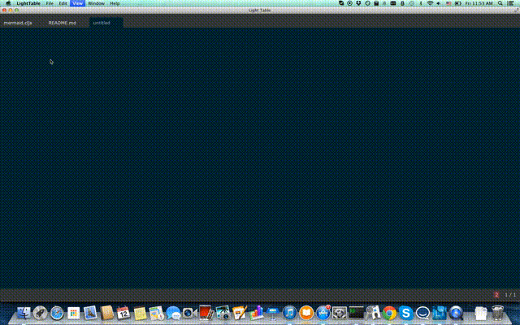

## Description

Mermaid is a Light Table plugin that generates diagrams and flowcharts from text using [mermaid](https://github.com/knsv/mermaid).

## Install

Install this plugin with LT's plugin manager or clone this project to your LT
plugins directory.

## Usage

Open a new file `Cmd-n` and execute the Mermaid command to watch your file and open a live tab. Any text you type
is watched and automatically generates a diagram in the live tab.

See the [Mermaid readme](https://github.com/knsv/mermaid#readme) for the different kinds of diagrams you can make.

## Bugs/Issues

Please report them [on github](http://github.com/cldwalker/Mermaid/issues).

## TODO
* Add a command to export generated svg based on http://bl.ocks.org/mbostock/6466603. Contribution
  most welcome as this method seems to loose a lot of styling.

## License
See LICENSE.txt

## Credits
* Thanks to @cognitect for open source fridays!
